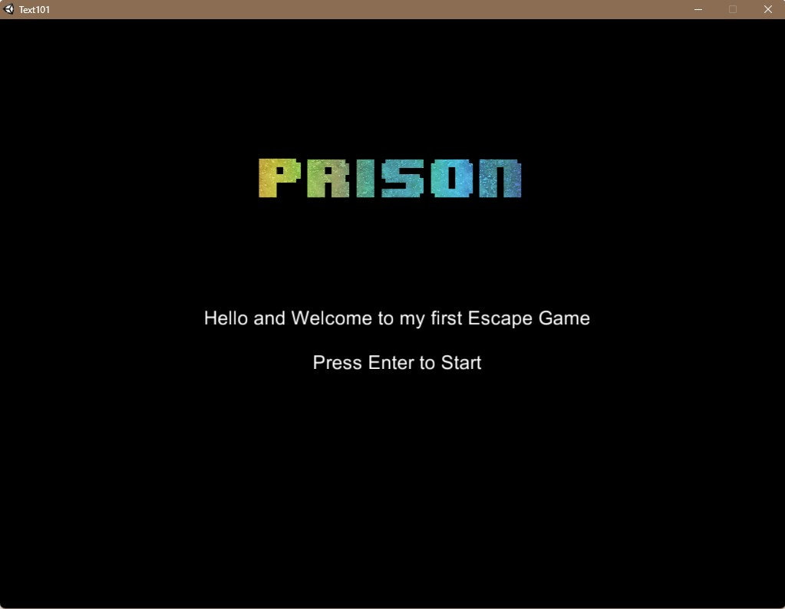
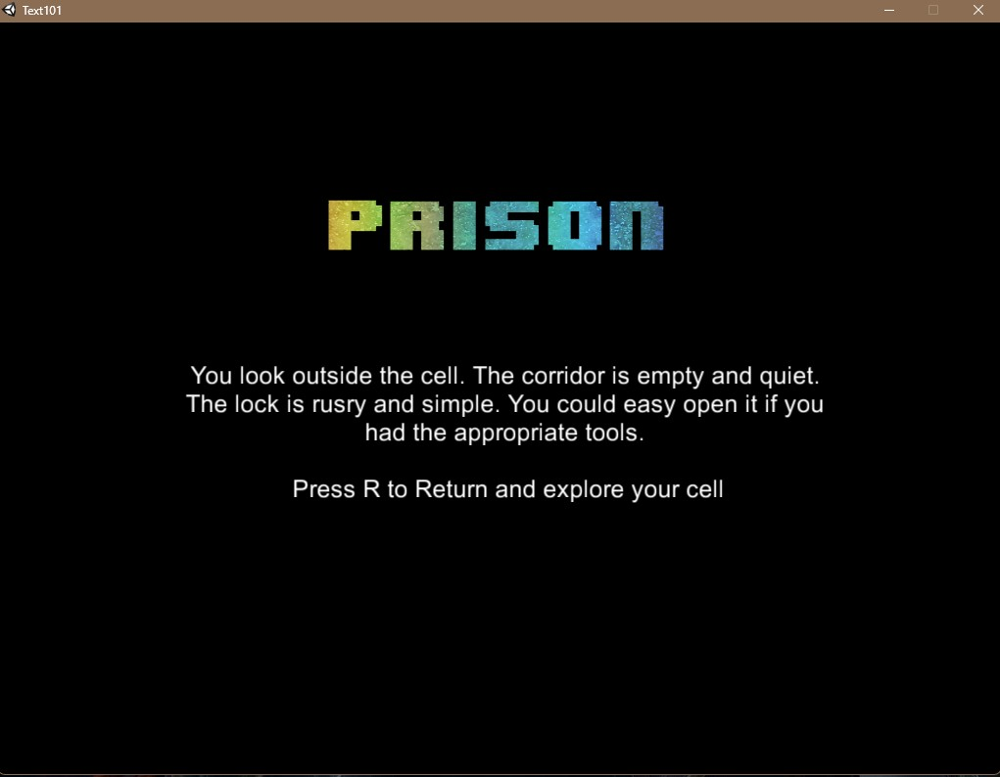
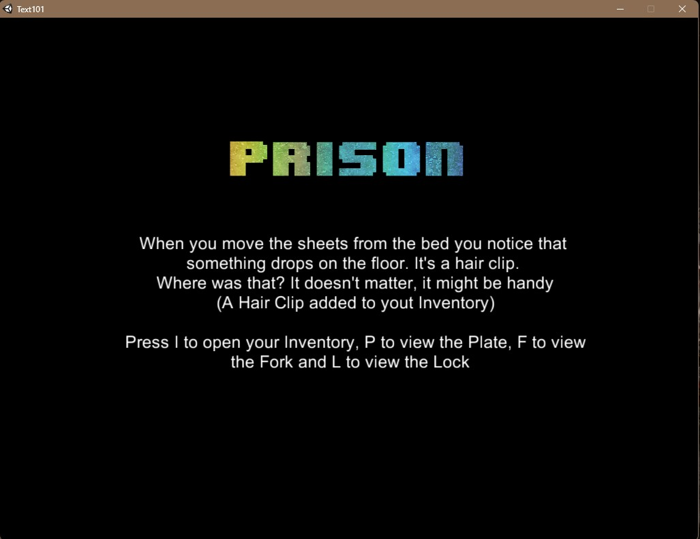

# Escape Prison

A text-based prison escape game built with Unity and C# as part of my game development training.

## Features

- Branching player choices
- Inventory system
- Item interactions
- Multiple game states
- Keyboard-based input
- Different paths depending on player decisions
- Escape and replay flow

## Built With

- Unity
- C#

## What I Practiced

This project helped me practice:

- C# logic
- State management
- Branching game flow
- User input handling
- Inventory and item interaction logic
- Debugging

## Screenshots

### Main Menu

### Gameplay

### Inventory / Item Interaction

## Project Background

This was created as a learning project while completing the Udemy course **Learn to Code by Making Games – Complete C# Unity Developer**.

I’m keeping it here as part of my early programming portfolio and as a record of my progress into software development.

## Notes

This repository focuses on the C# source code used to control the game logic. Some original project assets are not included.
